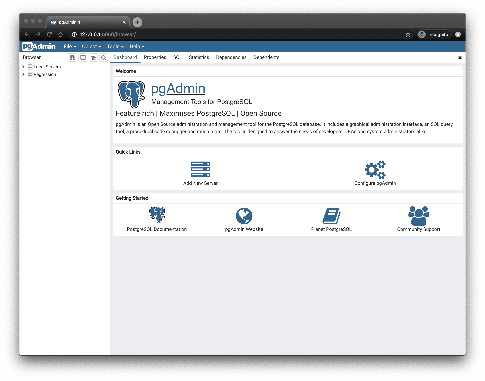

<!--
N.B.: This README was automatically generated by https://github.com/YunoHost/apps/tree/master/tools/README-generator
It shall NOT be edited by hand.
-->

# pgAdmin4 for YunoHost

[](https://dash.yunohost.org/appci/app/pgadmin)  

[](https://install-app.yunohost.org/?app=pgadmin)

*[Lire ce readme en français.](./README_fr.md)*

> *This package allows you to install pgAdmin4 quickly and simply on a YunoHost server.
If you don't have YunoHost, please consult [the guide](https://yunohost.org/#/install) to learn how to install it.*

## Overview

pgAdmin is a feature rich Open Source administration and development platform for PostgreSQL.


**Shipped version:** 7.6~ynh1

## Screenshots



## Disclaimers / important information

### Multi-users support

This app actually don't support the SSO and don't support LDAP. After the install of the app you can create a other user. So this app is multi-users but independently of the LDAP database.

## Documentation and resources

* Official app website: <https://www.pgadmin.org>
* Official admin documentation: <https://www.pgadmin.org/docs>
* YunoHost documentation for this app: <https://yunohost.org/app_pgadmin>
* Report a bug: <https://github.com/YunoHost-Apps/pgadmin_ynh/issues>

## Developer info

Please send your pull request to the [testing branch](https://github.com/YunoHost-Apps/pgadmin_ynh/tree/testing).

To try the testing branch, please proceed like that.

``` bash
sudo yunohost app install https://github.com/YunoHost-Apps/pgadmin_ynh/tree/testing --debug
or
sudo yunohost app upgrade pgadmin -u https://github.com/YunoHost-Apps/pgadmin_ynh/tree/testing --debug
```

**More info regarding app packaging:** <https://yunohost.org/packaging_apps>
